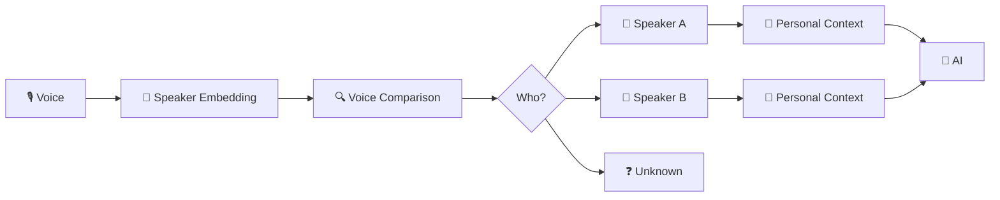
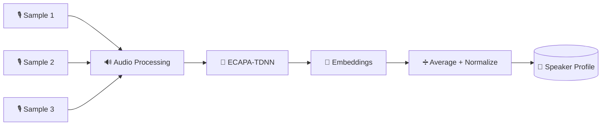
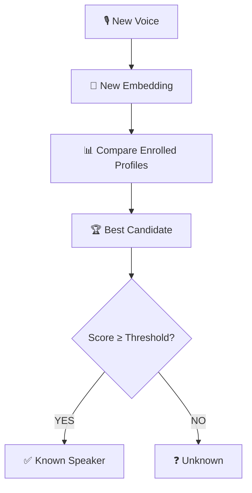
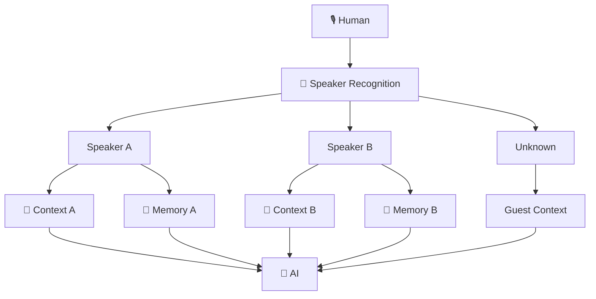
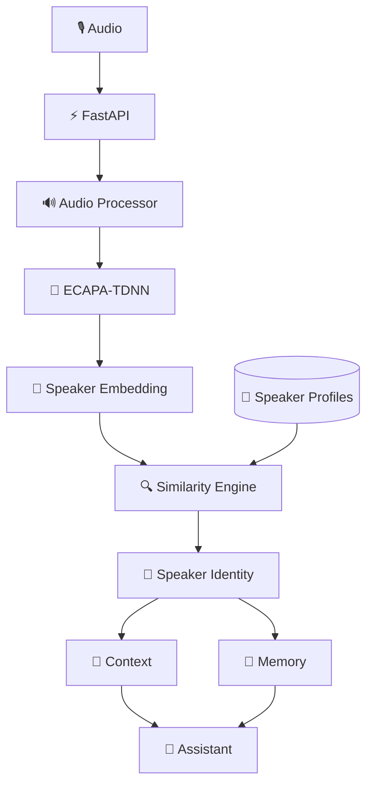
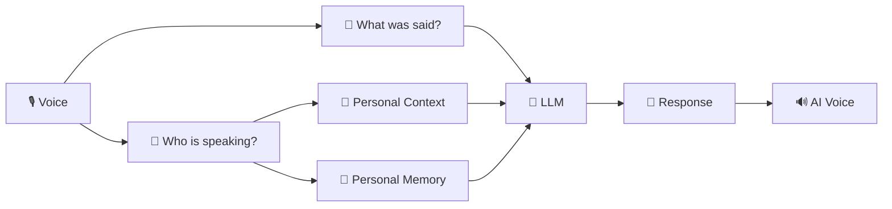

# 🎙️ WhoIsSpeaking AI

<p align="center">
  <b>Learn how AI recognizes who is speaking.</b>
</p>

<p align="center">
  An open-source educational project exploring speaker embeddings,
  voice enrollment, speaker recognition, and identity-aware AI.
</p>

<p align="center">
  
  
  
  
  
</p>

---

## 🧠 What is WhoIsSpeaking AI?

Most AI assistants understand:

> **What did you say?**

WhoIsSpeaking AI explores another question:

> **Who is speaking?**

The project demonstrates how a consenting speaker can enroll voice samples and how AI can transform those samples into speaker embeddings.

When another recording arrives, the system compares its embedding with enrolled profiles and attempts to determine the closest speaker.

---

## ⚡ The Idea



### One microphone. One AI. Multiple contexts.

---

## 🎯 Example

### Speaker A

```text
Speaker A:
"Hello AI."

AI:
"Hello Speaker A."
```

Then another enrolled person speaks:

```text
Speaker B:
"Hello."

AI:
"Hello Speaker B."
```

The application can switch the active context according to the recognized enrolled speaker.

---

# 🧬 How Speaker Enrollment Works

A speaker voluntarily provides several voice samples.



Instead of needing the raw recording for every comparison, the system creates a numerical representation called a:

**Speaker Embedding**

---

# 🔍 How Identification Works



The MVP uses **cosine similarity** to compare speaker embeddings.

A configurable threshold determines whether the closest candidate is accepted.

---

# 🧠 Identity-Aware AI

Recognizing an enrolled speaker is only the first step.

The result can also select separate AI context and memory.



This creates the foundation for an assistant that can maintain separate contexts for multiple enrolled people.

---

# ✨ Current Features

- 🎙️ Consent-based voice enrollment
- 🧬 Speaker embedding extraction
- 👥 Multiple enrolled speakers
- 🔍 Cosine similarity comparison
- ❓ Unknown-speaker rejection
- 🧠 Speaker-specific context
- 💾 Separate speaker memory
- ⚡ FastAPI REST API
- 📚 Interactive API documentation
- 🔐 Temporary raw audio handling
- 🆓 No paid AI API required for the base MVP

---

# 🏗️ Architecture



More architecture documentation is available in:

`docs/architecture.md`

---

# 📁 Project Structure

```text
who-is-speaking-ai/
├── README.md
├── LICENSE
├── requirements.txt
├── .gitignore
│
├── app/
│   ├── __init__.py
│   ├── main.py
│   │
│   ├── speaker/
│   │   ├── __init__.py
│   │   ├── enrollment.py
│   │   ├── embedding.py
│   │   └── identification.py
│   │
│   ├── speech/
│   │   ├── __init__.py
│   │   └── transcription.py
│   │
│   ├── assistant/
│   │   ├── __init__.py
│   │   ├── context.py
│   │   └── memory.py
│   │
│   └── api/
│       ├── __init__.py
│       └── routes.py
│
├── examples/
│   └── demo.py
│
├── tests/
│   └── __init__.py
│
└── docs/
    └── architecture.md
```

---

# 🚀 Installation

Python **3.11+** is recommended.

Clone the repository:

```bash
git clone https://github.com/YOUR_USERNAME/who-is-speaking-ai.git

cd who-is-speaking-ai
```

Create a virtual environment:

```bash
python -m venv .venv
```

Activate it on macOS/Linux:

```bash
source .venv/bin/activate
```

Windows PowerShell:

```powershell
.venv\Scripts\Activate.ps1
```

Install dependencies:

```bash
pip install -r requirements.txt
```

---

# ▶️ Run the API

```bash
uvicorn app.main:app --reload
```

Open:

```text
http://127.0.0.1:8000/docs
```

FastAPI will provide an interactive interface for testing the API.

---

# 🎙️ Enroll a Speaker

Endpoint:

```text
POST /api/enroll
```

For learning experiments, use several clear WAV or FLAC samples from the same consenting speaker.

Example:

```bash
curl -X POST http://127.0.0.1:8000/api/enroll \
  -F "name=SpeakerA" \
  -F "files=@sample_01.wav" \
  -F "files=@sample_02.wav" \
  -F "files=@sample_03.wav"
```

The samples are converted into embeddings and averaged into one speaker profile.

---

# 🔎 Identify a Speaker

Endpoint:

```text
POST /api/identify
```

Example:

```bash
curl -X POST http://127.0.0.1:8000/api/identify \
  -F "file=@unknown_voice.wav" \
  -F "threshold=0.65"
```

Possible response:

```json
{
  "ok": true,
  "identification": {
    "speaker": "SpeakerA",
    "best_candidate": "SpeakerA",
    "score": 0.82,
    "threshold": 0.65,
    "matched": true
  }
}
```

> **Important:** `0.65` is an educational starting value, not a universal identity threshold.

Real-world thresholds should be calibrated using recordings from the intended speakers, microphones, and environments.

---

# 🧠 Speaker Memory

Add a memory:

```text
POST /api/memory/{speaker}
```

Read memory:

```text
GET /api/memory/{speaker}
```

Delete memory:

```text
DELETE /api/memory/{speaker}
```

This demonstrates how different enrolled speakers can have independent application context.

---

# 📡 API

| Method | Endpoint | Purpose |
|---|---|---|
| `GET` | `/health` | Service health |
| `GET` | `/api/speakers` | List enrolled speakers |
| `POST` | `/api/enroll` | Enroll voice samples |
| `POST` | `/api/identify` | Identify closest speaker |
| `DELETE` | `/api/speakers/{name}` | Delete speaker |
| `GET` | `/api/memory/{speaker}` | Read memory |
| `POST` | `/api/memory/{speaker}` | Add memory |
| `DELETE` | `/api/memory/{speaker}` | Delete memory |

---

# 📚 Learning Roadmap

| Lesson | Topic |
|---|---|
| 01 | Understanding digital audio |
| 02 | Speaker embeddings |
| 03 | Voice enrollment |
| 04 | ECAPA-TDNN |
| 05 | Cosine similarity |
| 06 | Speaker identification |
| 07 | Unknown-speaker rejection |
| 08 | Speaker-specific context |
| 09 | Personal AI memory |
| 10 | Speech-to-text |
| 11 | LLM integration |
| 12 | Real-time voice assistant |

---

# 🔮 Future Learning Experiments



Possible future modules:

- 🎤 Real-time microphone input
- 📝 Speech-to-text
- 🌍 Multilingual speech
- 🤖 LLM integration
- 🔊 Text-to-speech
- 👥 Multi-speaker conversations
- 📊 Threshold calibration experiments
- 🔐 Encrypted speaker profiles
- 🌐 Web interface

---

# 🔐 Privacy & Ethics

Voice can be biometric information.

WhoIsSpeaking AI is designed as a **consent-based educational project**.

### Principles

- Enroll speakers only with their knowledge and consent.
- Do not secretly identify people.
- Avoid retaining raw recordings when they are unnecessary.
- Protect derived speaker embeddings.
- Provide an explicit `Unknown` result.
- Allow enrolled profiles to be deleted.

This repository is **not intended for covert surveillance**.

It is also not intended to be used as a high-security authentication system without substantial additional security engineering and evaluation.

---

# 🎓 Educational Purpose

This repository exists to help developers understand:

```text
Audio
   ↓
Neural Network
   ↓
Speaker Embedding
   ↓
Similarity
   ↓
Identity Decision
   ↓
Personal Context
```

The goal is learning how modern voice-aware AI systems can be constructed.

---

# 🌟 Vision

Most AI systems ask:

> **What did the human say?**

WhoIsSpeaking AI explores the next question:

> **Who is the AI interacting with?**

<p align="center">
  <b>One AI. Multiple enrolled speakers. Different context.</b>
</p>

---

## 🤝 Contributing

Educational contributions, experiments, documentation improvements, and responsible research are welcome.

If you find this project useful:

⭐ **Star the repository**

🍴 **Fork it**

🧪 **Experiment**

📚 **Learn**

🤝 **Contribute**

---

## 📄 License

MIT License

Copyright © 2026 Kaira Adira Rahayu