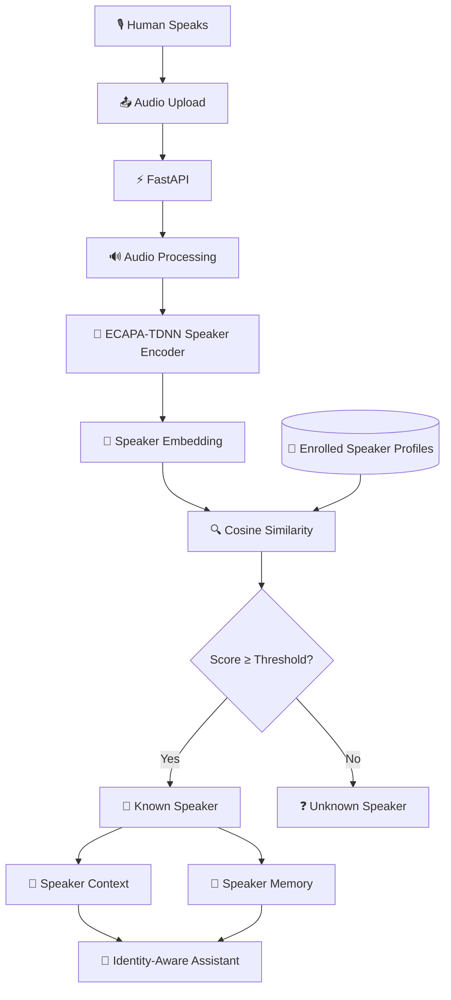
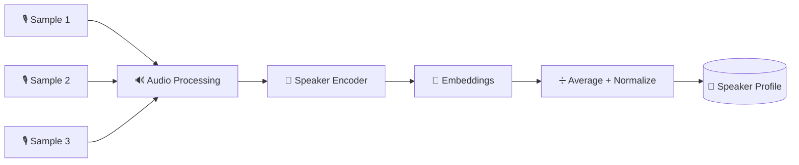
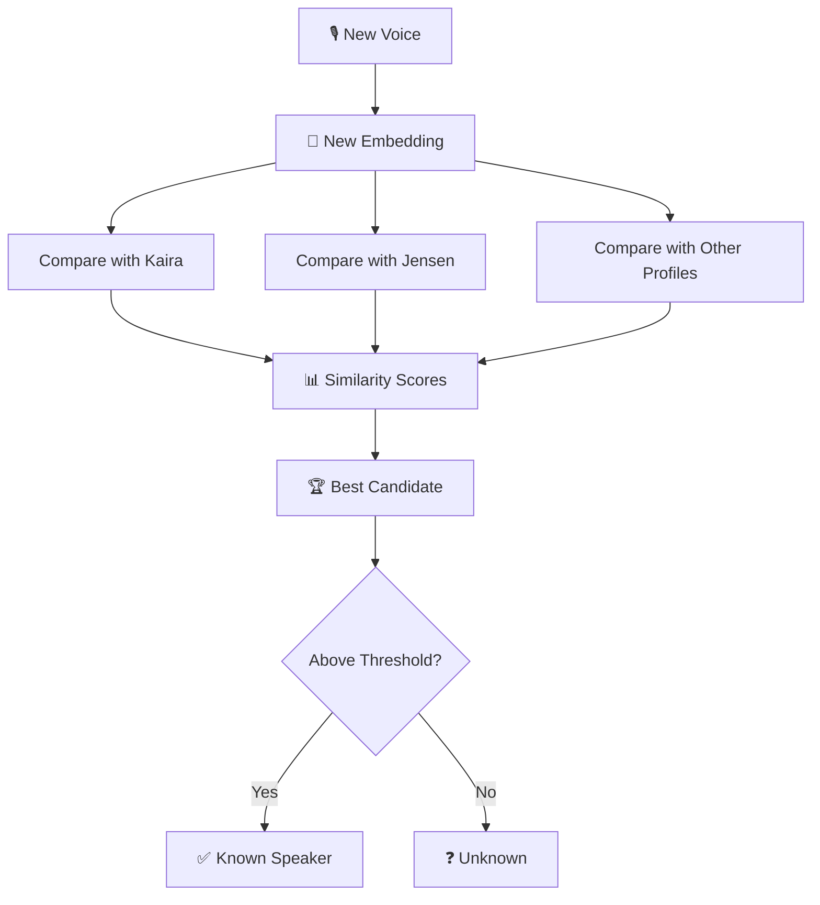
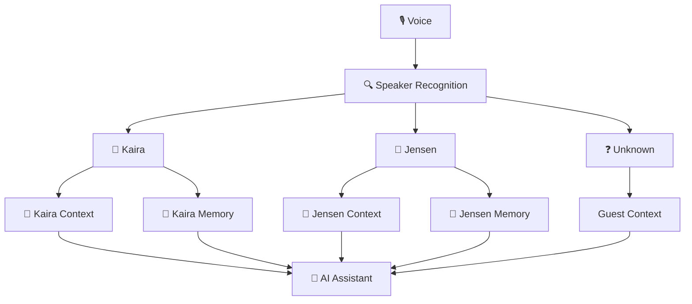
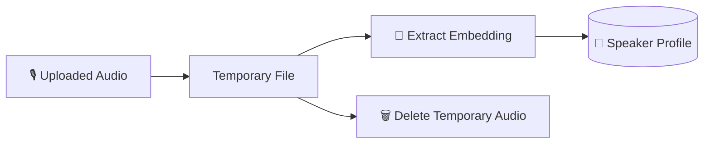
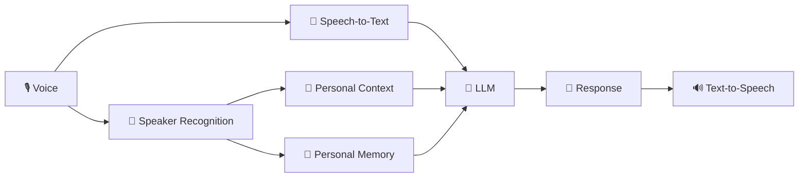

# 🏗️ WhoIsSpeaking AI — Architecture

WhoIsSpeaking AI is an educational project for learning how AI can distinguish between consenting, enrolled speakers using voice embeddings.

---

## 🎙️ System Flow



---

## 🧬 Voice Enrollment

Before the system can recognize a speaker, the speaker must voluntarily enroll voice samples.



Example:

```text
Kaira voice samples
        ↓
Audio Processing
        ↓
ECAPA-TDNN
        ↓
Speaker Embeddings
        ↓
Average + Normalize
        ↓
Kaira.npy
```

The raw uploaded audio is temporary.

The educational MVP keeps the derived speaker embedding profile instead.

---

## 🔍 Speaker Identification

When a new voice sample arrives:



The system compares embeddings using cosine similarity.

The profile with the highest similarity score becomes the best candidate.

A threshold is then used to decide whether the candidate should be accepted or returned as `Unknown`.

---

## 🧠 Identity-Aware Context

Speaker recognition can be connected to separate context and memory.



This demonstrates how one AI assistant could maintain different contexts for different enrolled speakers.

---

## 🗂️ Main Components

| Component | Purpose |
|---|---|
| `FastAPI` | Provides the HTTP API |
| `SpeechBrain` | Speaker-recognition model interface |
| `ECAPA-TDNN` | Creates speaker embeddings |
| `Torchaudio` | Loads and processes audio |
| `NumPy` | Stores and compares embeddings |
| `Speaker Enrollment` | Creates speaker profiles |
| `Identification` | Finds the closest enrolled speaker |
| `Context` | Loads speaker-specific context |
| `Memory` | Stores separate notes per speaker |

---

## 🔐 Privacy Model



Voice can be biometric information.

This project is therefore designed around:

- informed consent;
- voluntary speaker enrollment;
- temporary raw audio processing;
- local derived speaker profiles;
- explicit `Unknown` results;
- profile deletion;
- no covert identification.

---

## ⚠️ Educational Scope

WhoIsSpeaking AI is intended for:

**Education · Learning · Research · Experimentation**

It is **not** designed as a high-security authentication system.

Similarity thresholds must be calibrated using real samples and the actual recording environment.

---

## 🚀 Future Architecture



Future learning modules can explore:

- real-time microphone streaming;
- speech-to-text;
- multilingual transcription;
- LLM integration;
- text-to-speech;
- multiple speakers;
- better threshold calibration;
- encrypted speaker profiles.

---

## 🎯 Core Idea

> Most AI understands **what** was said.

WhoIsSpeaking AI explores how an AI system can also learn:

> **Who is speaking?**

---

**One AI. Multiple enrolled speakers. Different context.**